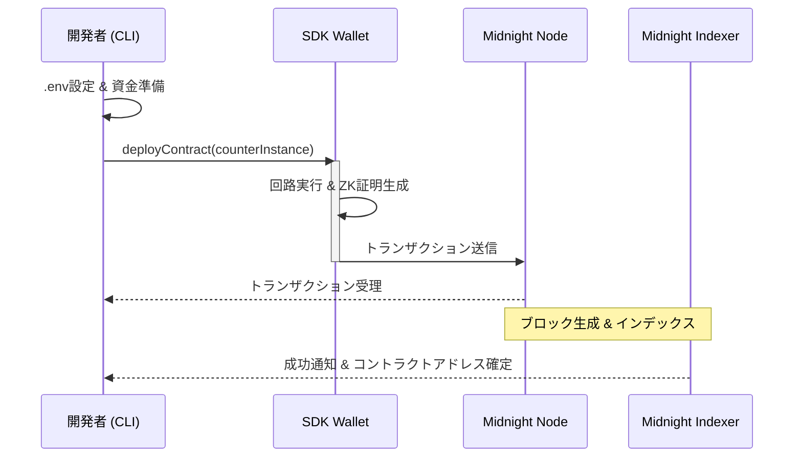
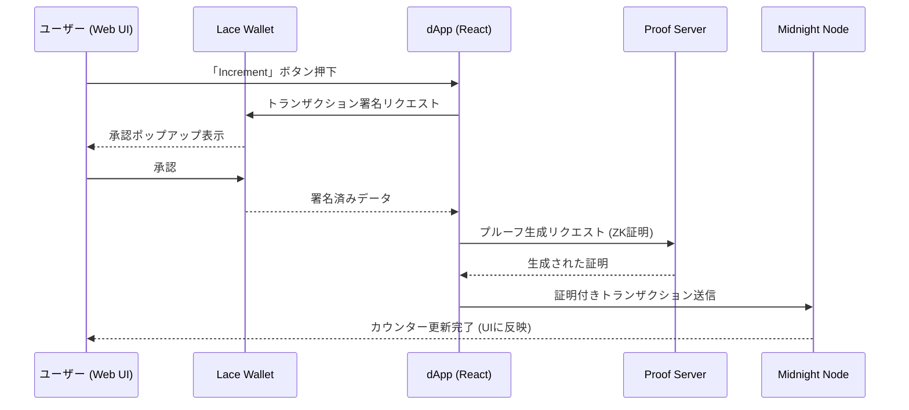

# midnight-sample-fullstack-app

Midnight Network上で動作する、ゼロ知識証明（ZK）を活用したフルスタック・カウンターdAppサンプルです。  
[Compact](https://midnight.network/developers)（ZKスマートコントラクト言語）、[Lace Wallet](https://www.lace.io/)、およびReactフロントエンドの統合デモを提供します。

## 🚀 概要

このプロジェクトは、Midnight NetworkのDApp Connector API v4を利用し、プライバシー保護と分散型台帳を組み合わせたアプリケーションの構築方法を示します。
ユーザーは、Lace Walletを介してトランザクションに署名し、バックエンドのプルーフサーバーでZK証明を生成、台帳上のカウンター値を安全に更新することができます。

### 主な特徴
- **ZKスマートコントラクト**: Compact言語によるビジネスロジックの実装。
- **Lace Wallet連携**: 最新のDApp Connector APIを用いたシームレスな接続。
- **マルチ環境対応**: ローカルのStandaloneノードからTestNetまで、CLIとAppの両方で対応。
- **リアルタイム同期**: RxJSを用いた台帳状態のリアルタイム・サブスクリプション。

---

## 🏗 機能一覧

| カテゴリ | 機能名 | 説明 | 実行パッケージ |
| :--- | :--- | :--- | :--- |
| **Contract** | コントラクトビルド | Compactファイルをコンパイルし、WASM/ZKIR/Managed Codeを生成。 | `pkgs/contract` |
| **Contract** | シミュレータテスト | `CounterSimulator`を用いて、実ネットワークなしでロジックを検証。 | `pkgs/contract` |
| **CLI** | デプロイ | Standalone/TestNet環境へコントラクトをデプロイし、アドレスを取得。 | `pkgs/cli` |
| **CLI** | カウンター操作 | CLIから直接カウンターのインクリメントや値の確認が可能。 | `pkgs/cli` |
| **App** | Lace Wallet接続 | ブラウザ拡張機能のLaceと接続し、アカウント情報を取得。 | `pkgs/app` |
| **App** | カウンター同期 | 指定したアドレスのコントラクトへ参加し、現在の値を自動取得。 | `pkgs/app` |
| **App** | ZKインクリメント | UIからボタン一つでZK証明を生成し、トランザクションを送信。 | `pkgs/app` |

---

## 🔄 処理シーケンス図

### 1. コントラクト・デプロイフロー (CLI)
開発者が新しいコントラクトをネットワーク上に公開する際の流れです。



### 2. カウンター・インクリメントフロー (Web App)
ユーザーがWeb画面からカウンターを更新する際の、Lace Walletとプルーフサーバーの連携フローです。



---

## 💻 技術スタック

| Layer | Technology |
|---|---|
| **Frontend** | React 19, Vite 5, Tailwind CSS v4, Lucide React, RxJS |
| **Contract** | Compact (Midnight ZK DSL) |
| **SDK** | `@midnight-ntwrk/*` (SDK v2 / DApp Connector API v4) |
| **Infrastructure** | Midnight Node, Indexer, Proof Server (Docker) |
| **Tooling** | Bun, Biome, Vitest, TypeScript |

---

## 📦 セットアップと実行

### Prerequisites
- [Bun](https://bun.sh) v1.1.x 以上
- [Lace Wallet](https://www.lace.io/) (Midnight テストネット対応版)
- [Docker](https://www.docker.com/)

### Quick Start
```bash
# 1. 依存関係のインストール
bun install

# 2. コントラクトのビルド
cd pkgs/contract && bun run build

# 3. ローカル・インフラの起動
cd ../cli
docker compose -f standalone.yml up -d

# 4. フロントエンドの起動
cd ../app
bun run dev
```

## 🛠 詳細コマンド

### Root
- `bun run build`: 全パッケージのビルドとキーの同期
- `bun run format`: Biomeによるコード整形
- `bun run lint`: 静的解析

### Frontend (`pkgs/app`)
- `bun run dev`: 開発サーバー起動 (http://localhost:5173)
- `bun run build`: 本番ビルド

### Contract (`pkgs/contract`)
- `bun run build`: Compactコンパイル
- `bun run test`: Vitestによるコントラクトテスト

### CLI (`pkgs/cli`)
- `bun run deploy`: コントラクトのデプロイ
- `bun run increment`: カウンターのインクリメント

---

## ⚙️ 環境変数

### `pkgs/app/.env.local`
```
VITE_NETWORK_ID=TestNet   # TestNet | DevNet | Standalone
```

### `pkgs/cli/.env.local`
```
NETWORK_ENV_VAR=standalone  # 接続先ネットワーク
SEED_ENV_VAR=               # ウォレットのシードフレーズ
CONTRACT_ADDRESS=           # デプロイ済みアドレス (インクリメント時に使用)
```

---

## 📜 ライセンス

MIT - See [LICENSE](LICENSE) for details.

---
*Created by Gemini CLI Agent.*
